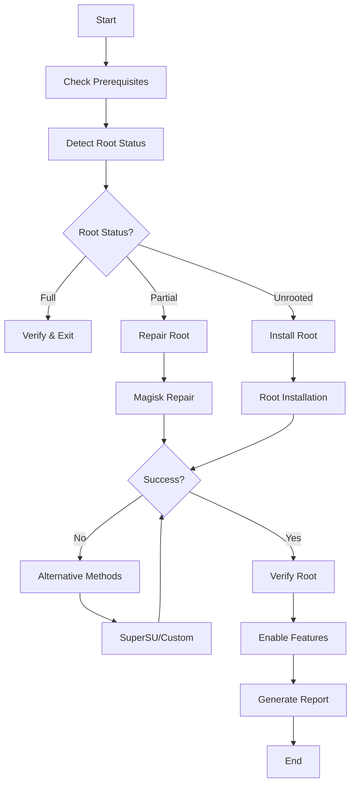

# Android Rooting Guide for Android 13 ARM64 Tablets

## Overview

This comprehensive guide provides production-grade Android rooting capabilities for Android 13 ARM64 tablets with integrated bot framework for error handling and live monitoring.

## Table of Contents

1. [Prerequisites](#prerequisites)
2. [Installation](#installation)
3. [Root Detection](#root-detection)
4. [Magisk Integration](#magisk-integration)
5. [Bot Framework](#bot-framework)
6. [Troubleshooting](#troubleshooting)
7. [Security Considerations](#security-considerations)
8. [References](#references)

## Prerequisites

### Device Requirements
- **Android Version**: 13+ (optimized for Android 13)
- **Architecture**: ARM64 (aarch64)
- **Device Type**: Tablets (tested on various ARM64 tablets)
- **Bootloader**: Unlocked (for full rooting capabilities)
- **Storage**: Minimum 2GB free space

### Software Requirements
- **Termux**: Latest version from F-Droid
- **Python**: 3.7+ (installed via Termux)
- **ADB**: Android Debug Bridge access
- **Fastboot**: For bootloader operations (optional)

### Permissions Required
- Storage access (for file operations)
- Network access (for bot framework)
- Developer options enabled
- USB debugging enabled

## Installation

### Step 1: Termux Setup

```bash
# Install Termux from F-Droid (recommended)
# https://f-droid.org/packages/com.termux/

# Update packages
pkg update && pkg upgrade -y

# Run the automated setup script
curl -sSL https://github.com/spiralgang/VARIABOT/raw/main/android_rooting/scripts/termux_setup.sh | bash
```

### Step 2: Manual Installation (Alternative)

```bash
# Clone the repository
git clone https://github.com/spiralgang/VARIABOT.git
cd VARIABOT/android_rooting

# Install required packages
pkg install python python-pip git curl wget -y

# Install Python dependencies
pip install requests urllib3 psutil pyyaml cryptography

# Make scripts executable
chmod +x scripts/*.sh core/*.py bots/*.py

# Create symlinks
ln -sf $(pwd)/scripts/android_root_complete.sh $PREFIX/bin/android-root
ln -sf $(pwd)/core/root_detector.py $PREFIX/bin/root-detect
ln -sf $(pwd)/core/magisk_manager.py $PREFIX/bin/magisk-manage
```

### Step 3: Environment Setup

```bash
# Source environment variables
source ~/.android_rooting/setup_env.sh

# Verify installation
root-detect --version
magisk-manage --version
android-root --help
```

## Root Detection

### Comprehensive Root Status Check

The framework provides multiple detection methods:

```bash
# Basic root status check
root-detect

# Detailed JSON output
root-detect --json

# Verbose logging
root-detect --verbose
```

### Detection Methods

1. **Binary Detection**: Checks for su, busybox, and root management binaries
2. **Package Detection**: Scans for Magisk, SuperSU, and other root packages
3. **Property Analysis**: Examines Android build properties
4. **SELinux Status**: Checks enforcement mode and policies
5. **Partition Analysis**: Examines system partition mount status

### Root Status Types

- **`full`**: Complete root access with functional su
- **`partial`**: Some root indicators present but incomplete
- **`unrooted`**: No root access detected
- **`unknown`**: Detection failed or inconclusive

## Magisk Integration

### Magisk Status Management

```bash
# Check Magisk status
magisk-manage status

# Repair partial Magisk installation
magisk-manage repair

# Install Magisk (requires unlocked bootloader)
magisk-manage install --method patch

# Module management
magisk-manage modules list
magisk-manage modules enable module_id
magisk-manage modules disable module_id
```

### Magisk Installation Methods

1. **Boot Image Patching** (Recommended)
   - Patches boot.img with Magisk
   - Preserves OTA capability
   - Safest method for most devices

2. **Fastboot Installation**
   - Direct fastboot flashing
   - Requires unlocked bootloader
   - Faster installation process

3. **Recovery Installation**
   - Custom recovery required
   - Traditional ZIP flashing
   - Legacy method support

### Zygisk Management

```bash
# Enable Zygisk (recommended for modern apps)
magisk-manage zygisk enable

# Disable Zygisk
magisk-manage zygisk disable

# Check Zygisk status
magisk-manage zygisk status
```

## Bot Framework

### Error Handler Bot

The integrated bot framework provides real-time error handling and monitoring:

```bash
# Start error handler bot
error-bot --daemon --config ~/.android_rooting/bot_config.json

# Interactive mode
error-bot --interactive

# Custom GitHub repository
error-bot --github-repo owner/repo --github-token TOKEN
```

### Bot Features

1. **Real-time Error Detection**
   - System health monitoring
   - Root process monitoring
   - Network connectivity checks
   - Resource usage tracking

2. **Automatic Error Handling**
   - Root failure recovery
   - Magisk error correction
   - Permission issue resolution
   - Network problem fixing

3. **Live Code Updates**
   - GitHub-driven updates
   - Hot code reloading
   - Automatic bot updates
   - Version management

4. **Audit Trail**
   - Comprehensive logging
   - Error event tracking
   - Action history
   - Performance metrics

### Bot Configuration

```json
{
    "github_repo": "spiralgang/VARIABOT",
    "github_token": "your_token_here",
    "update_interval": 30,
    "max_retries": 3,
    "error_threshold": 10,
    "auto_handle": true,
    "log_level": "INFO"
}
```

### Custom Error Handlers

```python
from android_rooting.bots.error_handler_bot import ErrorHandlerBot, ErrorEvent

# Create custom handler
def custom_root_handler(error_event: ErrorEvent) -> bool:
    if "specific_error" in error_event.message:
        # Handle specific error
        return True
    return False

# Register handler
bot = ErrorHandlerBot(config)
bot.register_error_handler("custom_category", custom_root_handler)
```

## Complete Root Process

### Automated Root Completion

```bash
# Complete root process with bot monitoring
android-root

# Force repair mode
android-root --force-repair

# Specific root method
android-root --method magisk

# Dry run (testing mode)
android-root --dry-run
```

### Manual Root Steps

```bash
# 1. Check current status
root-detect

# 2. Start monitoring bot
error-bot --daemon &

# 3. Attempt Magisk repair
magisk-manage repair

# 4. Verify completion
root-detect --verbose

# 5. Enable system functionality
android-root --enable-features
```

### Root Process Flow



## Troubleshooting

### Common Issues

#### 1. Permission Denied Errors

```bash
# Check file permissions
ls -la ~/android_rooting/scripts/

# Fix permissions
chmod +x ~/android_rooting/scripts/*.sh
chmod +x ~/android_rooting/core/*.py

# Setup storage access
termux-setup-storage
```

#### 2. Python Import Errors

```bash
# Reinstall Python packages
pkg install python python-pip -y
pip install --upgrade pip
pip install requests urllib3 psutil pyyaml
```

#### 3. Network Connectivity Issues

```bash
# Test network connectivity
test-network

# Check DNS resolution
nslookup google.com

# Reset network settings
setprop net.dns1 8.8.8.8
setprop net.dns2 8.8.4.4
```

#### 4. Root Detection Failures

```bash
# Manual root verification
su -c "id"

# Check Magisk status
magisk --version

# Verify system access
mount | grep system
ls -la /system/bin/su
```

#### 5. Bot Framework Issues

```bash
# Check bot status
ps aux | grep error_handler_bot

# View bot logs
tail -f ~/.android_rooting/logs/bot.log

# Restart bot
pkill -f error_handler_bot.py
error-bot --daemon
```

### Log Analysis

#### Important Log Files

1. **Main Rooting Logs**: `~/.android_rooting/logs/android_root_*.log`
2. **Bot Framework Logs**: `~/.android_rooting/logs/bot.log`
3. **Audit Trail**: `~/.android_rooting/logs/audit.log`
4. **Termux Setup**: `~/termux_setup_*.log`

#### Log Analysis Commands

```bash
# View recent errors
grep -i error ~/.android_rooting/logs/*.log | tail -20

# Monitor live logs
tail -f ~/.android_rooting/logs/android_root_*.log

# Search for specific issues
grep -r "permission denied" ~/.android_rooting/logs/

# Analyze bot events
jq '.category' ~/.android_rooting/logs/audit.log | sort | uniq -c
```

### Recovery Procedures

#### Emergency Root Repair

```bash
# Stop all processes
pkill -f android_root
pkill -f error_handler_bot

# Reset Magisk
magisk --stop
rm -f /data/adb/magisk.db
magisk --daemon

# Force repair
magisk-manage repair --force

# Verify recovery
root-detect --verbose
```

#### Framework Reset

```bash
# Backup logs
cp -r ~/.android_rooting/logs ~/android_rooting_backup_$(date +%Y%m%d)

# Reset framework
rm -rf ~/android_rooting ~/.android_rooting

# Reinstall
curl -sSL https://github.com/spiralgang/VARIABOT/raw/main/android_rooting/scripts/termux_setup.sh | bash
```

## Security Considerations

### Root Security Best Practices

1. **Access Control**
   - Use root access judiciously
   - Implement proper authentication
   - Monitor root usage

2. **SELinux Management**
   - Keep SELinux enforcing when possible
   - Use targeted policies
   - Monitor policy violations

3. **Network Security**
   - Secure bot communications
   - Use HTTPS for all connections
   - Implement proper authentication

4. **Audit Trail**
   - Enable comprehensive logging
   - Regular log review
   - Incident response procedures

### Privacy Protection

1. **Data Handling**
   - Minimize data collection
   - Encrypt sensitive information
   - Regular data cleanup

2. **Network Communications**
   - TLS encryption
   - Certificate validation
   - Secure API endpoints

### Compliance

1. **Device Management**
   - Corporate policy compliance
   - Security baseline adherence
   - Regular security updates

2. **Legal Considerations**
   - Warranty implications
   - Terms of service compliance
   - Local law adherence

## Performance Optimization

### System Resource Management

```bash
# Monitor resource usage
htop

# Check memory usage
free -h

# Disk space analysis
df -h

# Process monitoring
ps aux | grep -E "(magisk|su|root)"
```

### Bot Performance Tuning

```bash
# Adjust bot configuration
nano ~/.android_rooting/bot_config.json

# Monitor bot performance
tail -f ~/.android_rooting/logs/bot.log | grep performance

# Optimize update intervals
{
    "update_interval": 60,
    "error_threshold": 5,
    "max_retries": 2
}
```

## Advanced Usage

### Custom Root Methods

```python
# Example custom root method
from android_rooting.core.magisk_manager import MagiskManager

class CustomRootMethod:
    def __init__(self):
        self.magisk = MagiskManager()
    
    def attempt_root(self):
        # Custom rooting logic
        pass
    
    def verify_root(self):
        # Custom verification
        pass
```

### Bot Extensibility

```python
# Custom monitoring function
def custom_monitor():
    errors = []
    # Custom monitoring logic
    return errors

# Register with bot
bot.register_monitor(custom_monitor)
```

### GitHub Integration

```bash
# Setup GitHub integration
export GITHUB_TOKEN="your_token_here"
export GITHUB_REPO="your_repo"

# Enable live updates
error-bot --github-repo $GITHUB_REPO --github-token $GITHUB_TOKEN
```

## References

### Official Documentation
- [Android Security Model](https://source.android.com/security/overview/)
- [Magisk Documentation](https://github.com/topjohnwu/Magisk)
- [Android Debug Bridge (ADB)](https://developer.android.com/studio/command-line/adb)
- [Fastboot Protocol](https://android.googlesource.com/platform/system/core/+/master/fastboot/)

### Android Rooting Resources
- [XDA Developers Root Guide](https://www.xda-developers.com/root/)
- [Android Boot Image Format](https://source.android.com/devices/bootloader/boot-image-header)
- [SELinux for Android](https://source.android.com/security/selinux/)

### Kali Linux and Security
- [Kali NetHunter](https://www.kali.org/docs/nethunter/)
- [Android Penetration Testing](https://github.com/tanprathan/MobileApp-Pentest-Cheatsheet)
- [Mobile Security Testing Guide](https://github.com/OWASP/owasp-mstg)

### Termux Documentation
- [Termux Wiki](https://wiki.termux.com/)
- [Termux API](https://github.com/termux/termux-api)
- [Python in Termux](https://wiki.termux.com/wiki/Python)

### Bot Framework and Automation
- [Python Threading](https://docs.python.org/3/library/threading.html)
- [GitHub API](https://docs.github.com/en/rest)
- [Error Handling Best Practices](https://docs.python.org/3/tutorial/errors.html)

### Networking and Privilege Escalation
- [Linux Networking Commands](./LINUX_NETWORKING_COMMANDS_CHEATSHEET.md)
- [Android Networking](https://source.android.com/devices/tech/connect/)
- [Privilege Escalation Techniques](https://github.com/swisskyrepo/PayloadsAllTheThings/tree/master/Methodology%20and%20Resources)

---

**Disclaimer**: This guide is for educational and authorized testing purposes only. Rooting your device may void warranty, expose security risks, and violate terms of service. Use at your own risk and ensure compliance with applicable laws and policies.

**Last Updated**: $(date -Iseconds)
**Version**: 1.0.0
**Compatibility**: Android 13+ ARM64, Termux, Kali Linux